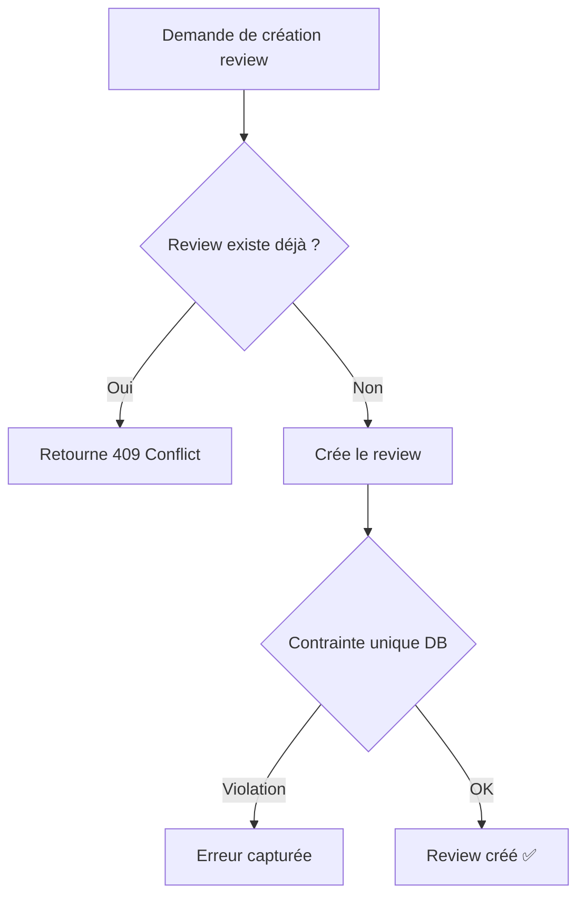

# 🛡️ Protection anti-duplication des reviews

## 📋 Problème résolu

Empêcher la création de reviews en double pour un même document, utilisateur et version afin d'éviter :
- Doublons dans la base de données
- Notifications multiples pour le même review
- Confusion pour les utilisateurs
- Incohérences dans les statistiques

---

## ✅ Solutions implémentées

### 1. **Contrainte unique au niveau base de données** (déjà existante)

Dans [schema.prisma](server/prisma/schema.prisma) :
```prisma
model DocumentReview {
  // ... autres champs
  
  @@unique([documentId, reviewerId, documentVersionId])
}
```

Cette contrainte garantit qu'**un seul review** peut exister pour une combinaison :
- `documentId` : ID du document
- `reviewerId` : ID de l'utilisateur reviewer
- `documentVersionId` : ID de la version du document

---

### 2. **Vérification au niveau service** 

#### a) Nouvelle méthode `findExistingReview()`

[documentreview.service.ts](server/src/services/documentreview.service.ts)

```typescript
/**
 * Check if a review already exists for a document, reviewer, and version
 */
async findExistingReview({
    documentId,
    reviewerId,
    documentVersionId,
}: {
    documentId: string;
    reviewerId: string;
    documentVersionId: string;
}) {
    return prisma.documentReview.findFirst({
        where: {
            documentId,
            reviewerId,
            documentVersionId,
        },
    });
}
```

#### b) Amélioration `assignReviewersToDocument()`

**Avant :**
```typescript
// Créait directement les reviews, risque de duplication
return prisma.documentReview.createMany({ data });
```

**Après :**
```typescript
// 1. Vérifie les reviews existants
const existingReviews = await prisma.documentReview.findMany({
    where: {
        documentId,
        documentVersionId,
        reviewerId: { in: uniqueReviewerIds },
    },
});

// 2. Filtre pour ne créer que les nouveaux
const existingReviewerIds = new Set(existingReviews.map(r => r.reviewerId));
const newReviewerIds = uniqueReviewerIds.filter(id => !existingReviewerIds.has(id));

// 3. Crée uniquement les reviews manquants
if (newReviewerIds.length === 0) {
    console.log(`[DocumentReview] All reviewers already have reviews`);
    return;
}
```

#### c) Amélioration `updateAssignedReviewersToDocument()`

```typescript
// Vérifie les reviews complétés pour ne pas les recréer
const existingReviews = await prisma.documentReview.findMany({
    where: {
        documentId,
        documentVersionId,
        reviewerId: { in: uniqueReviewerIds },
        isCompleted: true, // Don't recreate completed reviews
    },
});
```

---

### 3. **Vérification au niveau controller**

[documentreview.controller.ts](server/src/controllers/documentreview.controller.ts)

**Avant :**
```typescript
async create(req: Request, res: Response) {
    const { document, dueDate, reviewer, versionId } = req.body;
    
    const clause = await service.create({
        document: { connect: { id: document } },
        reviewer: { connect: { id: reviewer } },
        documentVersion: { connect: { id: versionId } },
        reviewDate: dueDate,
    });
    
    return res.status(201).json(clause);
}
```

**Après :**
```typescript
async create(req: Request, res: Response) {
    const { document, dueDate, reviewer, versionId } = req.body;
    
    // ✅ Vérification anti-duplication
    const existingReview = await service.findExistingReview({
        documentId: document,
        reviewerId: reviewer,
        documentVersionId: versionId,
    });

    if (existingReview) {
        return res.status(409).json({ 
            error: 'A review already exists for this document, reviewer, and version',
            code: 'ERR_REVIEW_DUPLICATE',
            existingReview: {
                id: existingReview.id,
                isCompleted: existingReview.isCompleted,
                reviewDate: existingReview.reviewDate,
            },
        });
    }
    
    const clause = await service.create({
        document: { connect: { id: document } },
        reviewer: { connect: { id: reviewer } },
        documentVersion: { connect: { id: versionId } },
        reviewDate: dueDate,
    });
    
    return res.status(201).json(clause);
}
```

---

## 🔄 Flux de protection



---

## 📊 Niveaux de protection

| Niveau | Méthode | Quand |
|--------|---------|-------|
| 🔴 **Controller** | `findExistingReview()` | Création manuelle via API |
| 🟡 **Service** | Filtre pré-création | Assignation batch de reviewers |
| 🟢 **Base de données** | Contrainte `@@unique` | Dernier rempart |

---

## 🧪 Tests de validation

### Test 1 : Création manuelle en double (API)

```bash
# 1ère tentative - devrait réussir
curl -X POST http://localhost:8000/reviews \
  -H "Authorization: Bearer TOKEN" \
  -H "Content-Type: application/json" \
  -d '{
    "document": "doc123",
    "reviewer": "user456",
    "versionId": "version789",
    "dueDate": "2026-02-15T00:00:00Z"
  }'

# Réponse attendue: 201 Created

# 2ème tentative - devrait échouer
# Même requête

# Réponse attendue: 409 Conflict
{
  "error": "A review already exists for this document, reviewer, and version",
  "code": "ERR_REVIEW_DUPLICATE",
  "existingReview": {
    "id": "review123",
    "isCompleted": false,
    "reviewDate": "2026-02-15T00:00:00.000Z"
  }
}
```

### Test 2 : Assignation batch

```typescript
// Scénario : Assigner plusieurs reviewers dont certains ont déjà un review
await reviewService.assignReviewersToDocument({
    documentId: 'doc123',
    documentVersionId: 'version789',
    reviewerIds: ['user1', 'user2', 'user3'], // user1 a déjà un review
    dueDate: new Date('2026-02-15'),
});

// Résultat attendu :
// - user1 : ignoré (review existe)
// - user2 : review créé ✅
// - user3 : review créé ✅

// Console log :
// [DocumentReview] All reviewers already have reviews for document doc123 (si tous existent)
// OU
// Crée uniquement les nouveaux reviews
```

### Test 3 : Job automatique

```typescript
// Le job generateDocumentReviewsJob utilise assignReviewersToDocument
// Vérifier qu'il ne crée pas de doublons lors des exécutions répétées

// Logs attendus :
// "Review already created for document doc123" (si review existe)
```

---

## 🚨 Gestion des erreurs

### Erreur 409 - Conflit de duplication

```typescript
{
  "error": "A review already exists for this document, reviewer, and version",
  "code": "ERR_REVIEW_DUPLICATE",
  "existingReview": {
    "id": "review_id",
    "isCompleted": boolean,
    "reviewDate": "ISO_DATE"
  }
}
```

**Actions frontend recommandées :**
- Si `isCompleted: false` → Rediriger vers le review existant
- Si `isCompleted: true` → Afficher message "Review déjà complété"
- Proposer de voir le review existant au lieu d'en créer un nouveau

---

## 📝 Checklist de vérification

- [x] Contrainte unique `@@unique` dans schema.prisma
- [x] Méthode `findExistingReview()` créée
- [x] `assignReviewersToDocument()` filtre les doublons
- [x] `updateAssignedReviewersToDocument()` préserve les reviews complétés
- [x] Controller `create()` vérifie avant insertion
- [x] Retourne erreur 409 avec détails du review existant
- [x] Logs informatifs pour debugging
- [x] Compatible avec jobs automatiques

---

## 🔧 Maintenance

### Ajouter une vérification supplémentaire

```typescript
// Dans un nouveau endpoint/service
async canCreateReview(documentId: string, reviewerId: string, versionId: string): Promise<boolean> {
    const existing = await this.findExistingReview({
        documentId,
        reviewerId,
        documentVersionId: versionId,
    });
    return !existing;
}
```

### Supprimer les doublons existants (migration)

```typescript
// Script de nettoyage à exécuter une fois
async function removeDuplicateReviews() {
    const duplicates = await prisma.documentReview.groupBy({
        by: ['documentId', 'reviewerId', 'documentVersionId'],
        _count: true,
        having: {
            _count: {
                gt: 1,
            },
        },
    });

    for (const dup of duplicates) {
        const reviews = await prisma.documentReview.findMany({
            where: {
                documentId: dup.documentId,
                reviewerId: dup.reviewerId,
                documentVersionId: dup.documentVersionId,
            },
            orderBy: { createdAt: 'asc' },
        });

        // Garder le premier, supprimer les autres
        const [keep, ...remove] = reviews;
        
        await prisma.documentReview.deleteMany({
            where: {
                id: { in: remove.map(r => r.id) },
            },
        });
    }
}
```

---

## 🎯 Résultats attendus

✅ **Aucun doublon** de reviews dans la base de données  
✅ **Erreur explicite** (409) lors de tentative de duplication  
✅ **Logs informatifs** pour monitoring et debugging  
✅ **Assignations batch** optimisées (évite requêtes inutiles)  
✅ **Jobs automatiques** ne créent pas de doublons  
✅ **Reviews complétés** préservés lors des mises à jour

---

## 📞 En cas de problème

1. **Vérifier les logs** : `grep "DocumentReview" logs/server.log`
2. **Vérifier la DB** : 
   ```javascript
   // Prisma Studio ou requête directe
   await prisma.documentReview.findMany({
     where: { documentId: 'DOC_ID' },
     select: { id: true, reviewerId: true, documentVersionId: true }
   });
   ```
3. **Tester la contrainte unique** : Essayer de créer un doublon manuellement et vérifier l'erreur

---

## 📚 Fichiers modifiés

1. [documentreview.service.ts](server/src/services/documentreview.service.ts) - Service principal
2. [documentreview.controller.ts](server/src/controllers/documentreview.controller.ts) - Controller API
3. [schema.prisma](server/prisma/schema.prisma) - Contrainte unique (déjà existante)
